# EntitySpaces 2026 – Guía Rápida
*Versión para desarrolladores que quieren empezar en menos de 15 minutos.*

*Última actualización: 30 Julio 2026*

---

## 📑 Tabla de contenido

- [EntitySpaces 2026 – Guía Rápida](#entityspaces-2026--guía-rápida)
  - [📑 Tabla de contenido](#-tabla-de-contenido)
  - [🚀 Novedades en EntitySpaces Studio 2026](#-novedades-en-entityspaces-studio-2026)
  - [1. Requisitos](#1-requisitos)
  - [2. Instalación paso a paso](#2-instalación-paso-a-paso)
    - [2.1. Descarga el instalador](#21-descarga-el-instalador)
    - [2.2. Ejecuta el instalador](#22-ejecuta-el-instalador)
    - [2.3. Pantalla de bienvenida](#23-pantalla-de-bienvenida)
    - [2.4. Selecciona la carpeta de instalación](#24-selecciona-la-carpeta-de-instalación)
    - [2.5. Confirmación de instalación](#25-confirmación-de-instalación)
    - [2.6. Progreso de la instalación](#26-progreso-de-la-instalación)
    - [2.7. Instalación completada](#27-instalación-completada)
  - [3. Primer arranque y configuración](#3-primer-arranque-y-configuración)
    - [3.1. Accede al Studio](#31-accede-al-studio)
    - [3.2. Verifica la versión instalada](#32-verifica-la-versión-instalada)
  - [4. Conectar a tu base de datos](#4-conectar-a-tu-base-de-datos)
  - [5. Generar las clases C# o VB.NET](#5-generar-las-clases-c-o-vbnet)
    - [5.1. Abre el panel de plantillas](#51-abre-el-panel-de-plantillas)
    - [5.2. Selecciona la plantilla "Generated - Classes Master"](#52-selecciona-la-plantilla-generated---classes-master)
    - [5.3. Configura los parámetros de generación](#53-configura-los-parámetros-de-generación)
    - [5.4. Ejecuta la generación](#54-ejecuta-la-generación)
    - [5.5. Verifica el código generado](#55-verifica-el-código-generado)
  - [6. Generar las clases Custom (se genera una sola vez)](#6-generar-las-clases-custom-se-genera-una-sola-vez)
    - [6.1. Ejecuta la plantilla "Custom - Classes Master"](#61-ejecuta-la-plantilla-custom---classes-master)
    - [6.2. Revisa la estructura generada](#62-revisa-la-estructura-generada)
    - [6.3. Explora el código de las clases Custom](#63-explora-el-código-de-las-clases-custom)
  - [7. Estructura de carpetas en Visual Studio](#7-estructura-de-carpetas-en-visual-studio)
  - [8. Pruebas unitarias con EntitySpaces y PostgreSQL](#8-pruebas-unitarias-con-entityspaces-y-postgresql)
    - [8.1. Configura el Loader y la conexión en tu prueba](#81-configura-el-loader-y-la-conexión-en-tu-prueba)
    - [8.2. Prueba de carga y consulta](#82-prueba-de-carga-y-consulta)
    - [8.3. Ejecuta las pruebas](#83-ejecuta-las-pruebas)
  - [9. Agregar los paquetes NuGet a tu proyecto](#9-agregar-los-paquetes-nuget-a-tu-proyecto)
  - [10. Configurar el Loader y la conexión en tu código](#10-configurar-el-loader-y-la-conexión-en-tu-código)
  - [11. Escribir tu primera consulta](#11-escribir-tu-primera-consulta)
  - [12. Uso con Wisej.NET](#12-uso-con-wisejnet)
  - [13. Solución de problemas comunes](#13-solución-de-problemas-comunes)
  - [14. Recursos adicionales](#14-recursos-adicionales)
    - [¡Listo! Con estos pasos ya tienes tu entorno funcionando y puedes empezar a desarrollar con EntitySpaces 2026.](#listo-con-estos-pasos-ya-tienes-tu-entorno-funcionando-y-puedes-empezar-a-desarrollar-con-entityspaces-2026)

---

## 🚀 Novedades en EntitySpaces Studio 2026

Esta versión del Studio incluye importantes mejoras de mantenimiento y rendimiento:

- **Modernización del motor de metadatos** – Se extraen propiedades avanzadas de los esquemas (`CharacterMaxLength`, `NumericPrecision/Scale`, `IsComputed`, `IsConcurrency`, `IsAutoIncrement`, `HasDefault` y `DataTypeNameComplete`) para todos los proveedores (SQL Server, PostgreSQL, MySQL, SQLite, Oracle y Firebird). El código generado refleja con precisión la estructura de tu base de datos.
- **Arquitectura x86 fija** – El ejecutable `StandAlone.exe` se compila siempre para x86, garantizando la compatibilidad con ensamblados nativos (`SQLite.Interop.dll`, ODP.NET). No más errores de arquitectura al abrir conexiones.

---

## 1. Requisitos

- **.NET Framework 4.8** o **.NET 8/9/10** (según tu proyecto).
- **Visual Studio 2022/26** (o 2019) con cargas de desarrollo de escritorio/Web.
- **EntitySpaces Studio 2026** (generador de código standalone).
- Permisos de administrador para la instalación (opcional, pero recomendado).

---

## 2. Instalación paso a paso

### 2.1. Descarga el instalador

1. Ve al repositorio GitHub:  
   [https://github.com/paulcordova/EntitySpaces](https://github.com/paulcordova/EntitySpaces)  
   y descarga el archivo `EntitySpacesStudio_2026.7.0030.0.exe` (o la versión más reciente) desde la sección **Releases**.

2. Guarda el archivo en tu equipo (ej. `Descargas`).

### 2.2. Ejecuta el instalador

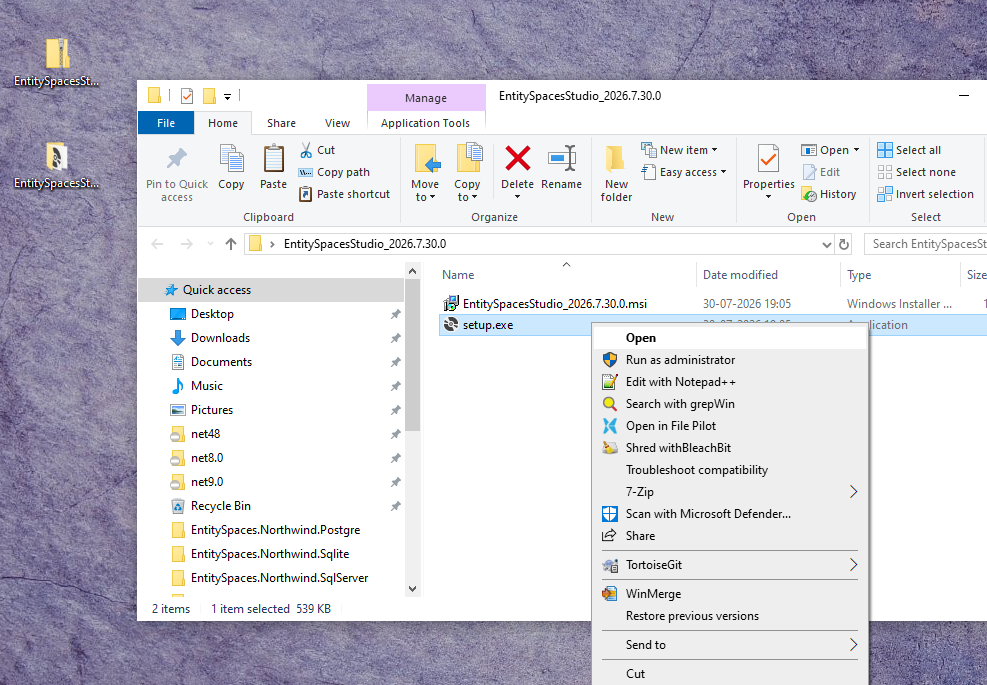

Haz doble clic sobre el archivo `.exe` descargado. Si Windows muestra una advertencia de seguridad, haz clic en **"Ejecutar de todas formas"**.

### 2.3. Pantalla de bienvenida

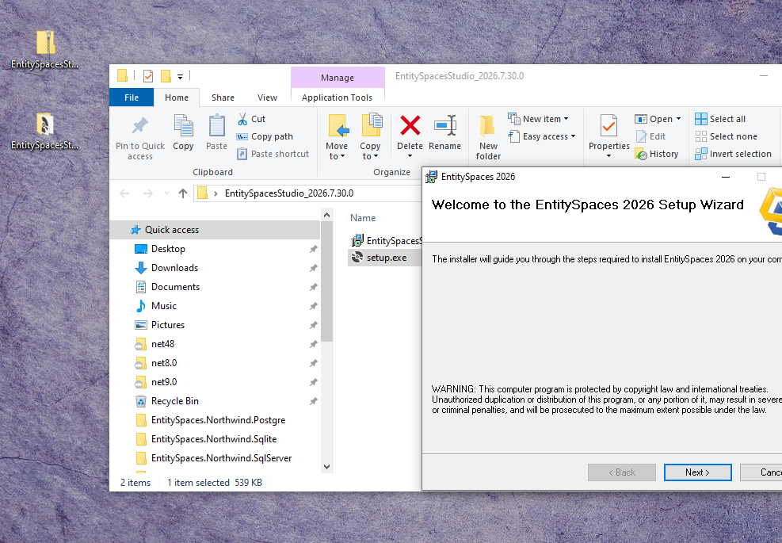

Se abrirá el asistente de instalación. Haz clic en **"Siguiente"** para continuar.

### 2.4. Selecciona la carpeta de instalación

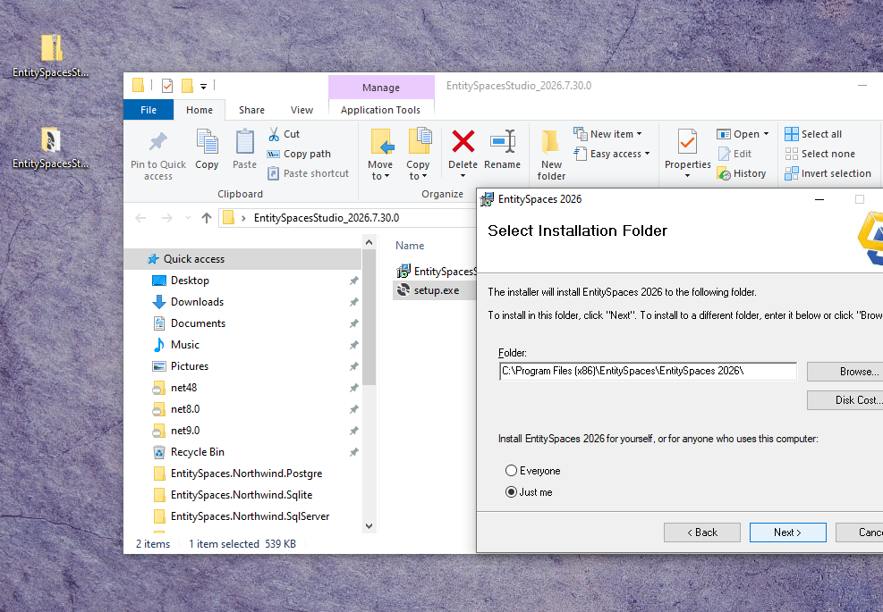

Por defecto, el instalador propone `C:\Program Files (x86)\EntitySpaces 2026\`. Puedes cambiarla si lo deseas.  
Haz clic en **"Siguiente"** después de elegir la ubicación.

### 2.5. Confirmación de instalación

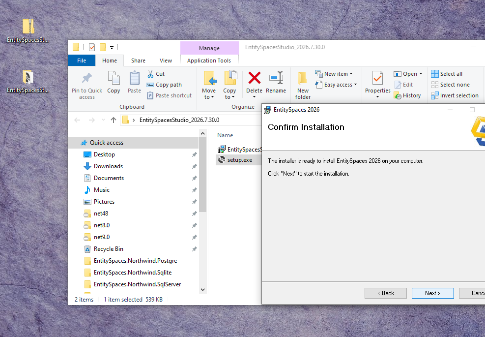

Revisa la carpeta de destino y los componentes que se instalarán. Haz clic en **"Instalar"** para comenzar la copia de archivos.

### 2.6. Progreso de la instalación


Espera mientras el instalador copia los archivos y registra los componentes necesarios.

### 2.7. Instalación completada

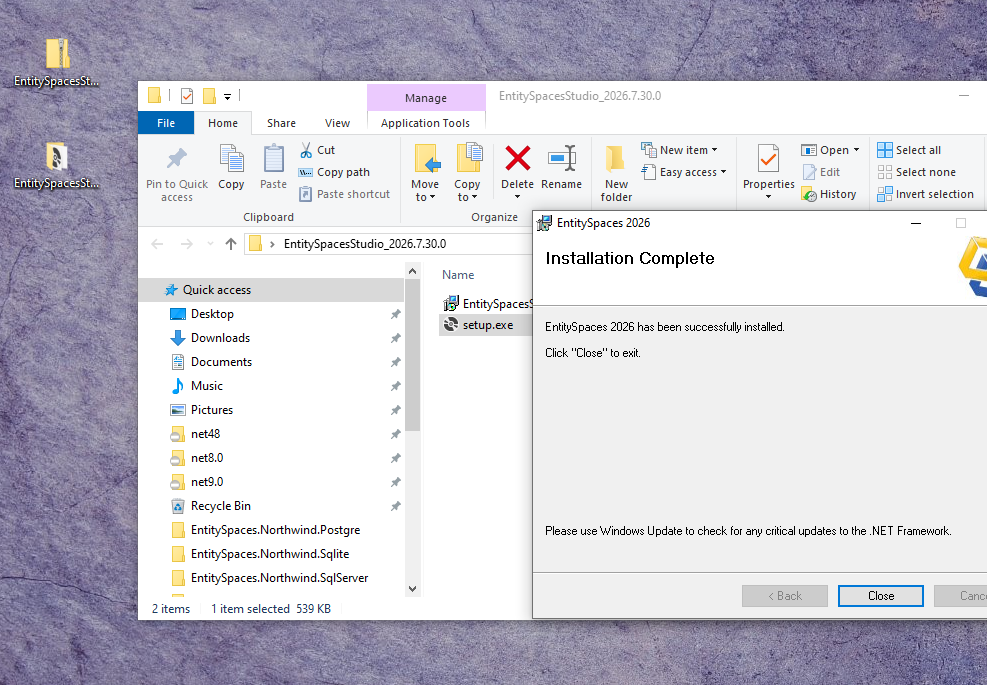

Una vez finalizada la instalación, marca la opción **"Launch EntitySpaces Studio"** si deseas abrir el Studio inmediatamente.  
Haz clic en **"Finalizar"** para cerrar el asistente.

---

## 3. Primer arranque y configuración

### 3.1. Accede al Studio

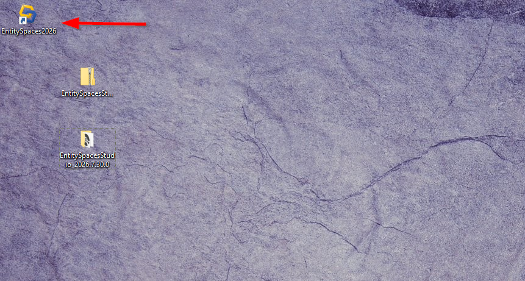

Puedes abrir el Studio desde el acceso directo creado en el **Escritorio** o desde el **Menú Inicio** → **EntitySpaces 2026**.

> **⚠️ Importante:** Ejecuta el Studio **como administrador** la primera vez (clic derecho → "Ejecutar como administrador"). Esto permite que el Studio cree las carpetas de configuración en `C:\ProgramData\EntitySpaces\ES2026` con los permisos correctos para todos los usuarios.

### 3.2. Verifica la versión instalada

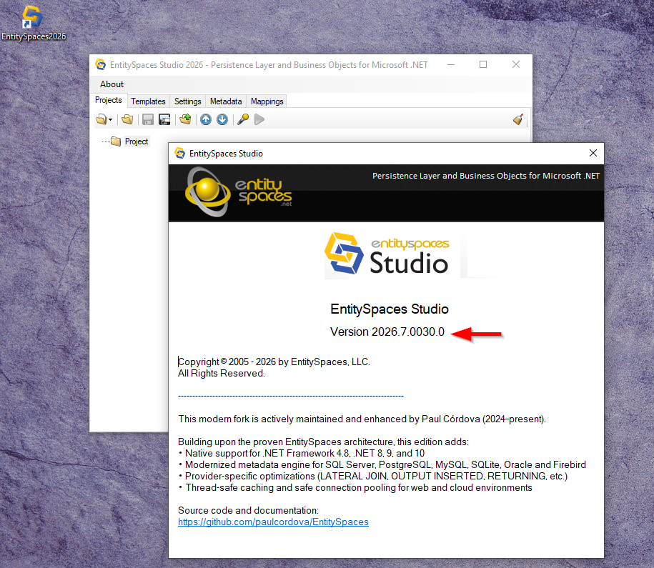

En la ventana principal, ve a **Ayuda → Acerca de...** y confirma que la versión sea la esperada (ej. `2026.7.0030.0`). Esto asegura que la instalación fue exitosa.

---

## 4. Conectar a tu base de datos

> ⚠️ **Importante:** Esta sección es previa a la generación de código; necesitas tener una conexión activa para que el Studio pueda leer el esquema.

1. Ve a la pestaña **Settings → Connection**.
2. Selecciona el **Driver** correspondiente a tu motor (SQL Server, PostgreSQL, MySQL, SQLite, Oracle, Firebird).
3. Haz clic en **Configure Connection** para construir la cadena de conexión, o escríbela manualmente.
4. Prueba la conexión con el botón **Test Connection**.

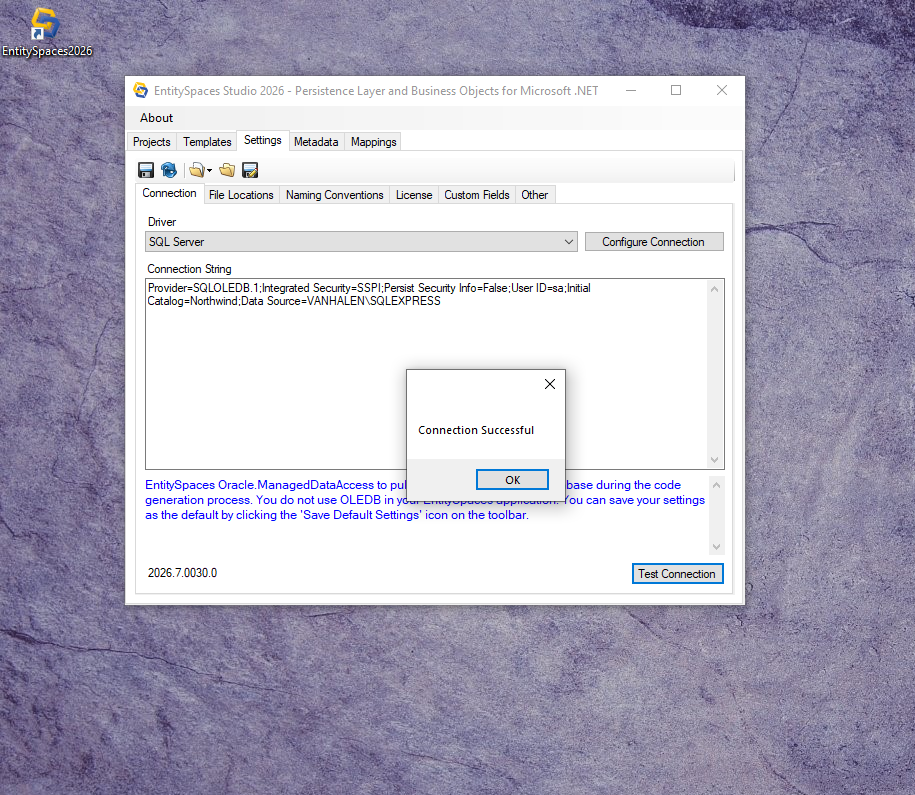

*Ejemplo: Configuración de conexión para SQL Server Local.*

**Cadenas de conexión de ejemplo:**

| Motor | Cadena de ejemplo |
|-------|-------------------|
| SQL Server | `User ID=sa;Password=...;Initial Catalog=Northwind;Data Source=localhost;TrustServerCertificate=True;` |
| PostgreSQL | `Host=localhost;Port=5432;Database=Northwind;Username=postgres;Password=...;SSL Mode=Require;` |
| MySQL | `Server=localhost;Port=3306;Database=Northwind;Uid=root;Pwd=...;SslMode=Required;` |
| SQLite | `Data Source=C:\Northwind.db3;Version=3;Foreign Keys=True;` |
| Oracle | `Data Source=...;User Id=...;Password=...;` (más configuración de wallet para ATP) |

---

## 5. Generar las clases C# o VB.NET

### 5.1. Abre el panel de plantillas

En el panel izquierdo del Studio, expande el árbol de tu proyecto (o crea uno nuevo en **File → New Project**).  
Haz clic derecho sobre la carpeta donde quieras generar el código y selecciona **"Add Recorded Template"** o **"Execute Template"**.

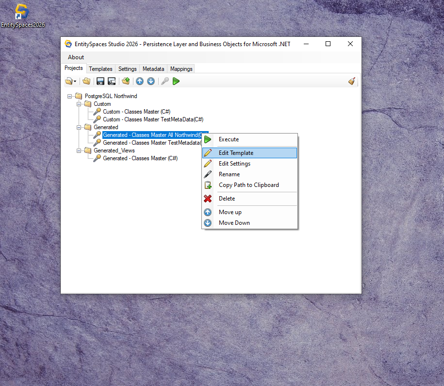

### 5.2. Selecciona la plantilla "Generated - Classes Master"

Aparecerá el diálogo de selección de plantilla. Navega a la carpeta **C#** (o VB) y elige **"Generated - Classes Master"**. Haz clic en **"OK"**.

### 5.3. Configura los parámetros de generación

En la ventana de configuración:

- Define el **Namespace** (ej. `BusinessObjects`).
- En la pestaña **"Input"**, selecciona las tablas o vistas que quieras generar.
- Puedes usar el botón **"Select All"** para elegir todas.
- En la pestaña **"Advanced"**, revisa opciones como `Generate a Single File` (recomendado) y `Metadata Class Should Ignore Schema` (para que las clases no incluyan el nombre del esquema en las propiedades).

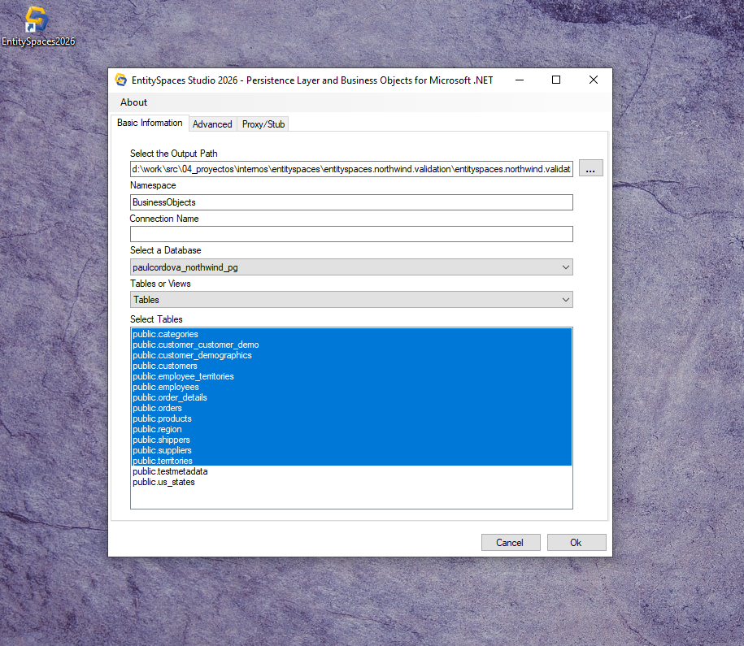

### 5.4. Ejecuta la generación

Haz clic en **"OK"**. El Studio generará los archivos en la carpeta de salida definida (por defecto, una subcarpeta `Generated` dentro de la carpeta del proyecto).  
Verás el progreso en la parte inferior de la ventana.

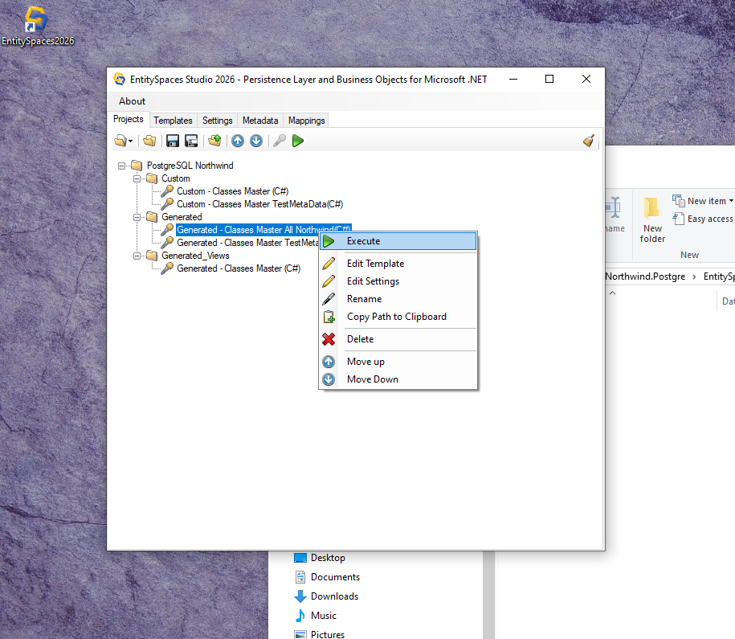

### 5.5. Verifica el código generado

En menos de un minuto, tendrás todos los archivos listos. Puedes abrirlos con el editor de tu preferencia o directamente desde el explorador de archivos.

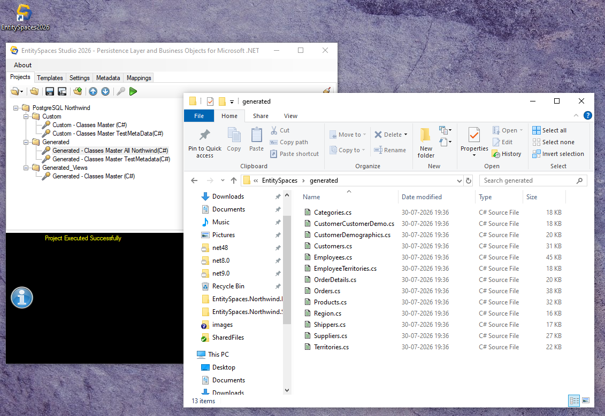

---

## 6. Generar las clases Custom (se genera una sola vez)

Las clases **Custom** se generan una única vez y son el lugar donde añadirás tu lógica de negocio, validaciones o métodos adicionales. **No se sobrescriben** al regenerar.

### 6.1. Ejecuta la plantilla "Custom - Classes Master"

Sigue el mismo proceso que en el paso anterior, pero selecciona la plantilla **"Custom - Classes Master"**.

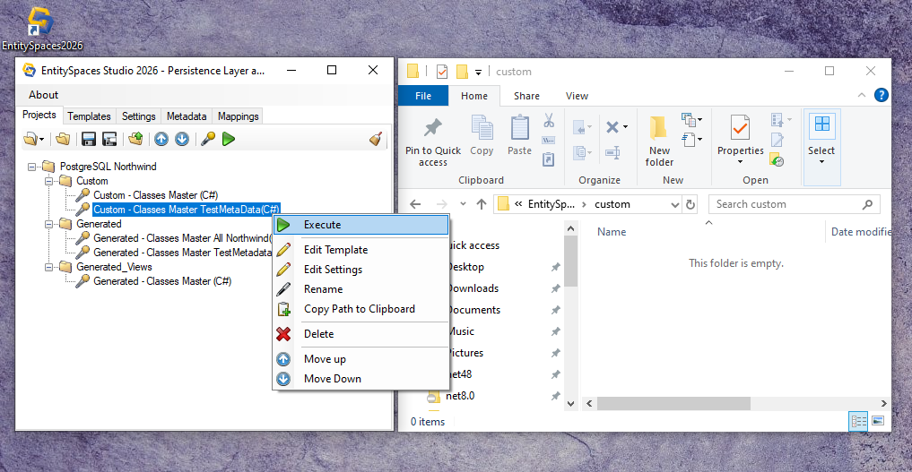

### 6.2. Revisa la estructura generada

Para cada tabla, se generan tres clases:

- **`{TableName}`** – la entidad (Custom).
- **`{TableName}Collection`** – la colección (Custom).
- **`{TableName}Query`** – la consulta fluida (Custom).

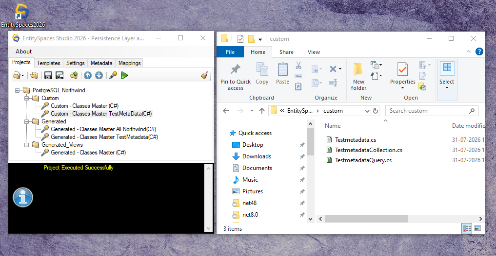

### 6.3. Explora el código de las clases Custom

Puedes abrir y modificar libremente estas clases para añadir propiedades calculadas, métodos de negocio o sobrecargas de `Save()`.

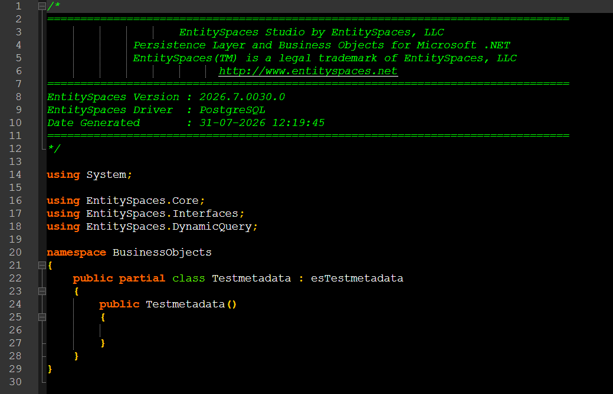

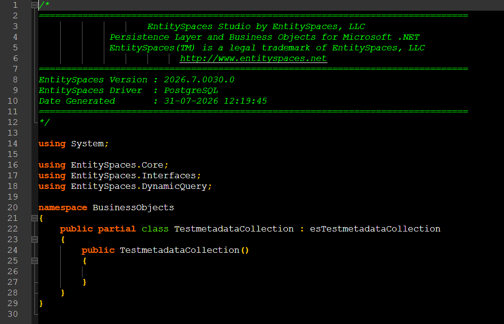

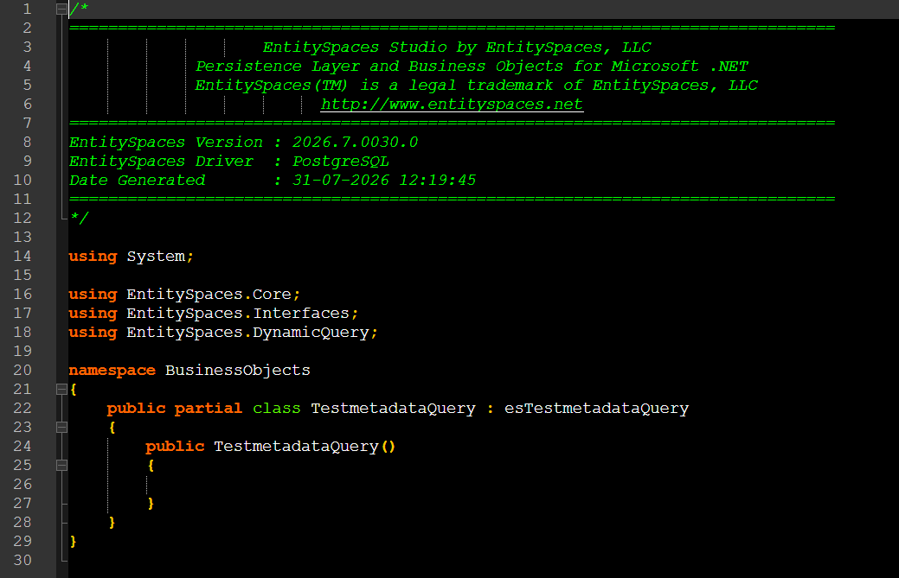

---

## 7. Estructura de carpetas en Visual Studio

Una vez generados los archivos, los añadirás a tu proyecto de Visual Studio. La estructura recomendada es separar las clases `Generated` (que se regeneran) de las `Custom` (que contienen tu lógica).

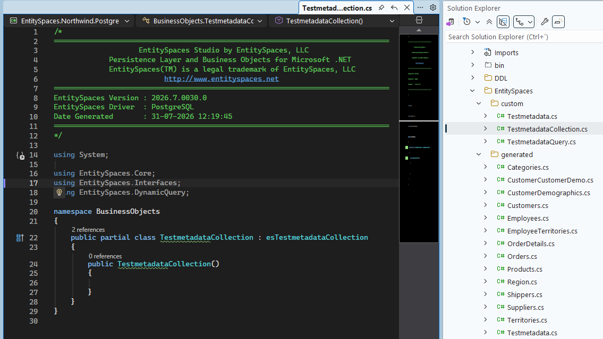

- **Carpeta `Generated`**: Contiene los archivos generados automáticamente. **No los edites** (se sobrescriben al regenerar).
- **Carpeta `Custom`**: Contiene tus clases de negocio. **Aquí es donde trabajas**.

---

## 8. Pruebas unitarias con EntitySpaces y PostgreSQL

Para verificar que tu configuración y clases funcionan correctamente, puedes escribir pruebas unitarias sencillas.

### 8.1. Configura el Loader y la conexión en tu prueba

```csharp
[SetUp]
public void Setup()
{
    esProviderFactory.Factory = new EntitySpaces.LoaderMT.esDataProviderFactory();
    esConnectionElement conn = new esConnectionElement();
    conn.Provider = "EntitySpaces.PostgreSQLProvider";
    conn.ConnectionString = "Host=localhost;Port=5432;Database=Northwind;Username=postgres;Password=...;SSL Mode=Require;";
    esConfigSettings.ConnectionInfo.Connections.Add(conn);
    esConfigSettings.ConnectionInfo.Default = "Northwind";
}
```

### 8.2. Prueba de carga y consulta

```csharp
[Test]
public void CanLoadAllCustomers()
{
    var customers = new CustomersCollection();
    Assert.IsTrue(customers.LoadAll());
    Assert.Greater(customers.Count, 0);
}

[Test]
public void CanQueryCustomersByCountry()
{
    var coll = new CustomersQuery("c", out var c)
        .Where(c.Country == "USA")
        .ToCollection<CustomersCollection>();
    Assert.Greater(coll.Count, 0);
}
```

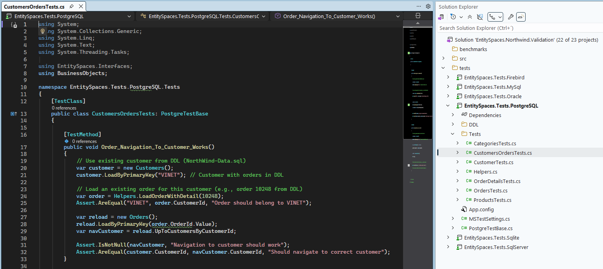

### 8.3. Ejecuta las pruebas

Asegúrate de que el proveedor de PostgreSQL esté correctamente referenciado (paquete NuGet `EntitySpaces.ORM.PostgreSQL.NET`).

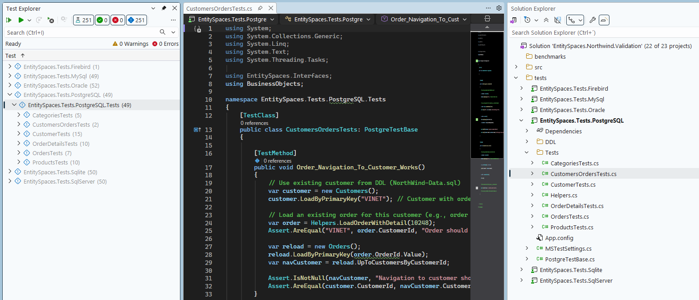

Si todo está correcto, las pruebas se ejecutarán con éxito.

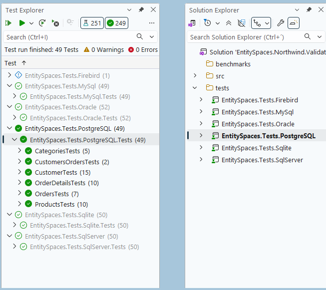

---

## 9. Agregar los paquetes NuGet a tu proyecto

Abre tu proyecto en Visual Studio y agrega el paquete del proveedor que necesites.

**Desde la consola de Package Manager:**

```powershell
# Ejemplo para SQL Server
Install-Package EntitySpaces.ORM.SqlServer.NET

# Para PostgreSQL
Install-Package EntitySpaces.ORM.PostgreSQL.NET

# Para MySQL
Install-Package EntitySpaces.ORM.MySQL.NET

# Para SQLite
Install-Package EntitySpaces.ORM.SQLite.NET

# Para Oracle Managed Client
Install-Package EntitySpaces.ORM.OracleManagedClient.NET

# Para Firebird (próximamente)
Install-Package EntitySpaces.ORM.Firebird.NET
```

Estos paquetes incluyen todas las dependencias necesarias (`EntitySpaces.Core`, `EntitySpaces.Interfaces`, `EntitySpaces.DynamicQuery`, el Loader y el proveedor específico).

---

## 10. Configurar el Loader y la conexión en tu código

EntitySpaces necesita que registres el **Loader** (medio confiable o estándar) y la **cadena de conexión**.

**En el inicio de tu aplicación (ej. `Program.Main`, `Global.asax`, o constructor del formulario principal):**

```csharp
using EntitySpaces.Interfaces;

// 1. Registrar el Loader (versión medio confiable, recomendada)
esProviderFactory.Factory = new EntitySpaces.LoaderMT.esDataProviderFactory();

// 2. Configurar la conexión
esConnectionElement conn = new esConnectionElement();
conn.Provider = "EntitySpaces.SqlClientProvider";   // Cambia según tu proveedor
conn.ConnectionString = "User ID=...;Password=...;Initial Catalog=Northwind;Data Source=localhost;";
conn.SqlAccessType = esSqlAccessType.DynamicSQL;    // o StoredProcedure
conn.DatabaseVersion = "2016";                      // Opcional, se auto-detecta

// 3. Agregar la conexión y establecerla como predeterminada
esConfigSettings.ConnectionInfo.Connections.Add(conn);
esConfigSettings.ConnectionInfo.Default = "Northwind"; // nombre que le quieras dar
```

**Alternativa:** usar un archivo `app.config` / `web.config` con la sección `<EntitySpaces>`. La guía completa está en el README del repositorio.

---

## 11. Escribir tu primera consulta

Con las clases generadas y la configuración lista, puedes cargar datos:

```csharp
// Cargar todos los clientes
CustomersCollection customers = new CustomersCollection();
if (customers.LoadAll())
{
    foreach (Customers cust in customers)
    {
        Console.WriteLine($"{cust.CustomerID} - {cust.CompanyName}");
    }
}

// Consulta con filtro (API fluida)
CustomersCollection coll = new CustomersQuery("c", out var c)
    .Where(c.Country == "USA")
    .OrderBy(c.CompanyName.Ascending)
    .ToCollection<CustomersCollection>();

// CRUD básico
Customers newCust = new Customers();
newCust.CustomerID = "NEWCO";
newCust.CompanyName = "Nueva Empresa";
newCust.Save();                     // INSERT

newCust.CompanyName = "Nueva Empresa S.A.";
newCust.Save();                     // UPDATE

newCust.MarkAsDeleted();
newCust.Save();                     // DELETE
```

---

## 12. Uso con Wisej.NET

[**Wisej.NET**](https://wisej.com) es un framework que permite desarrollar aplicaciones web con la misma lógica y modelo de eventos que Windows Forms. EntitySpaces se integra perfectamente:

- Puedes reutilizar todas tus clases generadas y tu lógica de negocio existente.
- El patrón de conexión y transacciones es idéntico al de una aplicación de escritorio.
- El ORM maneja correctamente el *pooling* y la concurrencia en el entorno web (gracias al caché de parámetros thread‑safe y al manejo de transacciones en `finally`).

**Ejemplo en un control Wisej:**

```csharp
// En el evento Click de un botón
private void buttonLoad_Click(object sender, EventArgs e)
{
    var products = new ProductsCollection();
    products.Query.Where(products.Query.UnitPrice > 10);
    products.Query.Load();

    dataGridView1.DataSource = products;
}
```

Puedes consultar la [documentación oficial de Wisej.NET](https://wisej.com/documentation/) para más detalles sobre el despliegue.

---

## 13. Solución de problemas comunes

| Problema | Solución |
|----------|----------|
| **"No se encuentra el ensamblado EntitySpaces.Core"** | Asegúrate de haber instalado el paquete NuGet correcto y que esté referenciado en el proyecto. |
| **"Error al conectar con SQLite"** | Verifica que la cadena incluya `Version=3;Foreign Keys=True;` y que el archivo .db3 exista. |
| **El Studio no ve las tablas** | En el Studio, asegúrate de haber seleccionado el catálogo/Base de datos correcto en el desplegable después de conectar. |
| **Excepción de concurrencia al guardar** | EntitySpaces lanza `esConcurrencyException` para violaciones de clave, deadlocks, etc. Captúrala y maneja el conflicto según tu lógica de negocio. |
| **Error de permisos en `ProgramData\EntitySpaces\ES2026`** | Asegúrate de ejecutar el Studio como administrador la primera vez, o concede permisos de escritura a la carpeta para tu usuario (o grupo "Usuarios autenticados"). |
| **El Studio no guarda la lista de proyectos recientes (MRU)** | Verifica que la clave de registro `HKEY_CURRENT_USER\Software\EntitySpaces 2026` exista y que tu usuario tenga permisos de escritura. Si no existe, ejecuta el Studio como administrador una vez para crearla. |

---

## 14. Recursos adicionales

- **Repositorio GitHub:** [https://github.com/paulcordova/EntitySpaces](https://github.com/paulcordova/EntitySpaces)  
  - Código fuente, ejemplos completos, historial de cambios.
- **Documentación extendida:** Dentro del repositorio encontrarás el `README.md` con todos los detalles técnicos, incluyendo la migración de metadatos, proveedores y mejores prácticas.
- **Foro / Issues:** Usa GitHub Issues para reportar problemas o sugerir mejoras.
- **Consultoría:** Contacta a `paul.cordova@netstep.cl` para soporte profesional o formación.

---

### ¡Listo! Con estos pasos ya tienes tu entorno funcionando y puedes empezar a desarrollar con EntitySpaces 2026.

